# Manual de Usuario: Envío de Correos

## Objetivo

Se requiere el desarrollo de un sistema de envío de correos personalizado que permita adaptar el asunto, el cuerpo del mensaje y los archivos adjuntos en varios idiomas. Esto debe parametrizarse en las selecciones de informe para que funcione de la manera más estándar posible.

## Manual de Usuario

### Configuraciones

#### Cuentas de correo electrónico

Es necesario configurar una cuenta de correo electrónico predeterminada, la cual debe ser una cuenta de la empresa para que funcione correctamente.

He añadido dos enlaces a tutoriales para configurar cuentas en Business Central:

- [Configurar cuenta de correo electrónico 365 en Business Central](#)
- [Configurar correo Gmail en Business Central](#)

### Selección de informes de venta

A continuación, se muestra un ejemplo de configuración para el envío de factura proforma, aunque se puede aplicar a cualquier tipo de documento deseado.

1. Se debe configurar el tipo y después el ID del informe como adjunto. Este suele ser el que se utiliza para imprimir y que se marcará como adjunto.
2. También deben informarse los informes para el asunto y cuerpo del mensaje.

En este caso, lo ideal es utilizar el mismo informe para obtener los datos en el layout. Se debe configurar el asunto y el cuerpo, y como opción, se puede establecer cada uno en un idioma diferente. Si se deja el idioma en blanco, se usará para todos los idiomas del documento.

#### Configuración del Asunto

1. Hacer clic en el campo de descripción de diseño del asunto de correo electrónico.
2. Crear uno nuevo y marcar la opción de insertar diseño de Word.
3. Configurar una descripción para el asunto correctamente.
4. Importar y/o exportar el layout para modificarlo.

**Imágenes de ejemplo:**

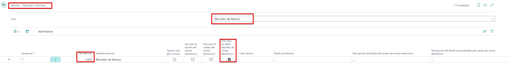
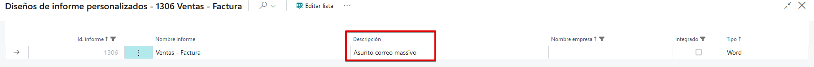
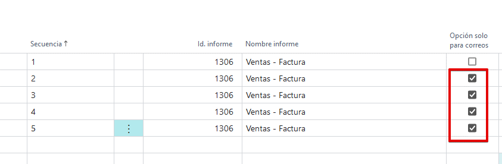

#### Configuración del Cuerpo del Mensaje

El proceso es similar al del asunto, pero aplicándolo al campo correspondiente al cuerpo del mensaje.

**Imágenes de ejemplo:**

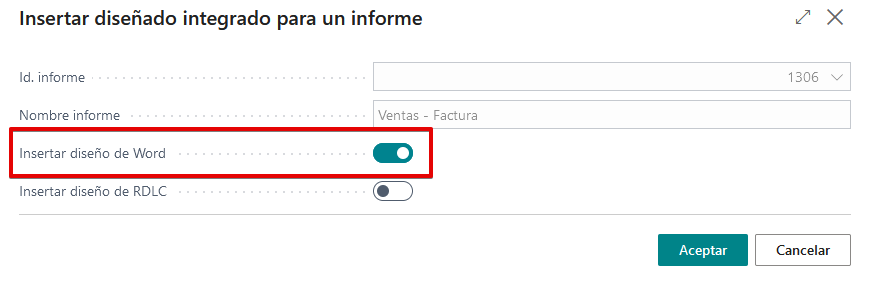
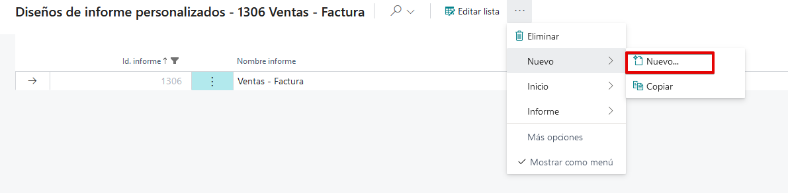
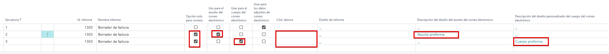

Es importante que, si no es una opción especial, se marque el booleano “opción solo para correos” en los cuerpos y los asuntos para que al imprimir no aparezca toda la secuencia.

Esto debe realizarse para cada idioma que se desee añadir. Un ejemplo con varios idiomas sería algo así:

**Imágenes de ejemplo:**

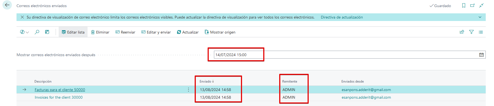
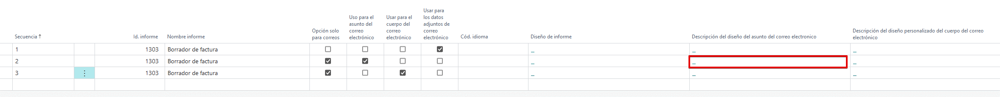
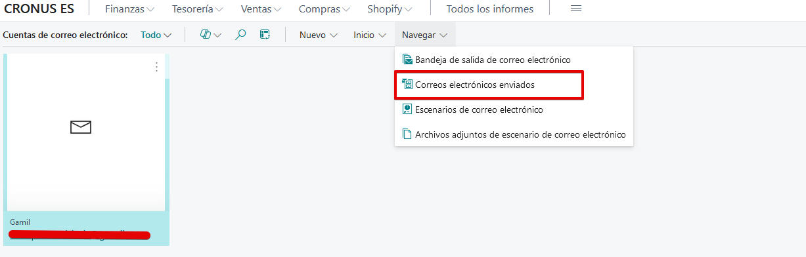

### Revisar el Envío de Correos

En las cuentas de correo electrónico se puede revisar el historial de los correos electrónicos enviados, así como quién los ha enviado, la fecha y la hora.

**Imágenes de ejemplo:**

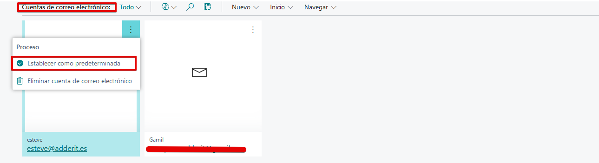
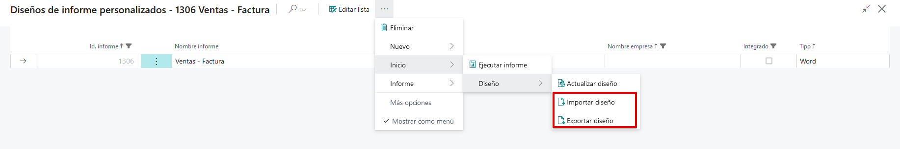
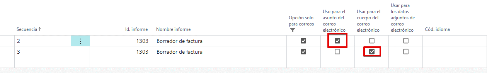
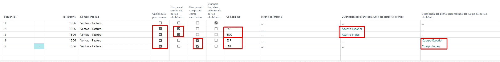

---

**Nota:** Debes asegurarte de que la carpeta `img` contiene todas las imágenes mencionadas en el `README.md`.
